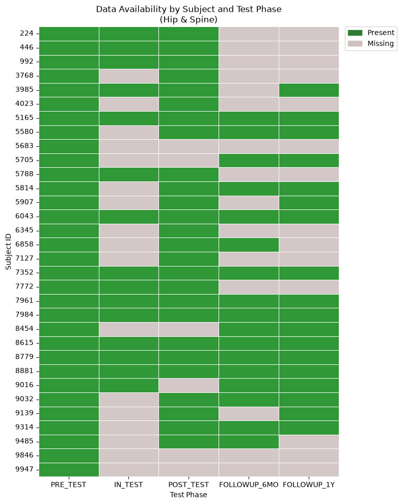

# NASA Bedrest Study: Hip and Spine Bone Density Analysis

[](https://www.python.org/)
[](https://pandas.pydata.org/)
[](https://numpy.org/)
[](https://scipy.org/)
[](https://www.statsmodels.org/)
[](https://matplotlib.org/)
[](https://seaborn.pydata.org/)
[](https://jupyter.org/)

Longitudinal analysis of bone mineral density (BMD) changes at the hip and spine during prolonged bedrest and recovery.

## Overview

Extended bedrest provides a ground-based model of skeletal unloading, with relevance to the bone loss experienced during spaceflight. This project examines BMD measurements collected before, during and after bedrest, with follow-up measurements at six months and one year.

The main focus is whether the hip and spine respond differently to unloading and subsequent recovery.

Five study phases were analysed:

- `PRE_TEST`
- `IN_TEST`
- `POST_TEST`
- `FOLLOWUP_6MO`
- `FOLLOWUP_1Y`

The final dataset contains **218 observations across hip and spine combined**.

## Data Preparation

The raw hip data contained separate left- and right-side measurements. These were merged and averaged to obtain a single hip BMD value for each participant and study phase.

Some records were also missing reliable phase or day labels. Where possible, these were reconstructed from filenames and associated metadata.

During the initial data-loading process, a problem was identified that was silently excluding some follow-up scans. This was corrected before the final analysis. Because recovery was an important part of the research question, the follow-up data were checked explicitly after correction.

## Missingness

A subject-by-phase availability matrix was used to check whether measurements were available across the study period and whether hip and spine follow-up data were aligned.



This helped distinguish genuine longitudinal patterns from changes that might simply reflect differences in data availability between phases.

## Statistical Analysis

Pre- and post-bedrest measurements were compared using paired **Cohen's *dz***.

| Site | Cohen's *dz* |
|---|---:|
| Hip | **1.88** |
| Spine | **0.31** |

The main longitudinal analysis used a **linear mixed-effects model** in `statsmodels`, with BMD modelled as a function of study phase, skeletal site and their interaction. A random intercept for participant was included to account for repeated measurements.

In simplified form:

```text
BMD ~ Test Phase × Site + (1 | Subject)```
Percentage changes from baseline were calculated from the fitted model, with 95% confidence intervals.
Results
Hip
The hip showed the clearest response to bedrest. Model estimates indicated a 3.15% decrease during bedrest and a 2.62% decrease immediately post-bedrest.
By six months, the estimated change was +0.12% relative to baseline, and at one year it was +0.36%. Both follow-up estimates were compatible with baseline.
The large pre-vs-post effect size (Cohen's dz = 1.88) supports the substantial within-subject change observed at the hip.
Spine
The spine showed a much smaller change. The model estimated a 0.13% decrease during bedrest and a 0.38% decrease immediately post-bedrest.
The estimated changes were −0.96% at six months and −0.72% at one year. However, the 95% confidence intervals included zero at each phase.
Therefore, while the point estimates remained slightly below baseline during follow-up, the analysis does not provide sufficient evidence to conclude that persistent spine BMD loss occurred.
The pre-vs-post effect size was much smaller than for the hip (Cohen's dz = 0.31).
Model Estimates
Site	Phase	Change from baseline	95% CI
Hip	In-bedrest	−3.15%	−6.08% to −0.23%
Hip	Post-bedrest	−2.62%	−5.02% to −0.22%
Hip	6 months	+0.12%	−2.67% to +2.92%
Hip	1 year	+0.36%	−2.38% to +3.10%
Spine	In-bedrest	−0.13%	−3.01% to +2.75%
Spine	Post-bedrest	−0.38%	−2.75% to +1.98%
Spine	6 months	−0.96%	−3.72% to +1.80%
Spine	1 year	−0.72%	−3.43% to +1.98%
Individual Trajectories
Individual trajectories show variation between participants while also illustrating the overall difference between the two skeletal sites.

The model-based results provide a clearer comparison of estimated change from baseline.

The hip shows a pronounced reduction during bedrest followed by recovery towards baseline. Changes at the spine are considerably smaller and more uncertain.
Files
File	Description
nasa_bedrest_bmd_analysis.ipynb	Full analysis notebook
Nasa_bedrest.py	Python analysis script
effect_sizes.csv	Paired Cohen's dz results
model_estimated_changes.csv	Model-based BMD and percentage-change estimates with 95% CIs
final_model_results.csv	Summary of the main results
missing_figures.png	Subject × phase data availability
individual_trajectories.png	Individual BMD trajectories
model-estimated_changes.png	Model-estimated percentage changes
Analysis Notebook and Script
nasa_bedrest_bmd_analysis.ipynb
The Jupyter Notebook documents the full analysis workflow, including data preparation, missingness assessment, exploratory analysis, effect-size calculations, mixed-effects modelling, model-based estimates and visualisation.
Nasa_bedrest.py
The Python script provides a standalone version of the core data-processing, statistical modelling and visualisation workflow.
Keeping both files provides an interactive record of the analysis alongside a reproducible script-based implementation.
Limitations
The number of observations is not necessarily identical across all study phases because of missing scans and incomplete follow-up.
The findings are specific to the study cohort and should not automatically be generalised to all populations exposed to prolonged immobilisation or spaceflight.
For the spine, the relatively small estimated changes and confidence intervals crossing zero mean that the results should be interpreted cautiously. In particular, the follow-up estimates should not be described as definitive evidence of persistent bone loss.
The mixed-effects model also depends on the assumptions of the fitted model, and the analysis describes longitudinal changes across bedrest and recovery rather than independently establishing causality.
Summary
The main finding is a clear difference in the response of the hip and spine to prolonged unloading.
Hip BMD decreased substantially during bedrest and showed recovery towards baseline during follow-up. Spine BMD changed much less, with no statistically clear evidence of persistent change through one year.
The analysis highlights the importance of treating skeletal sites separately and accounting for repeated measurements when analysing longitudinal BMD data.
